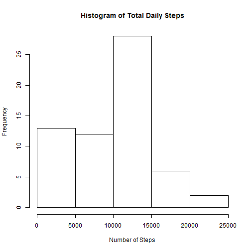
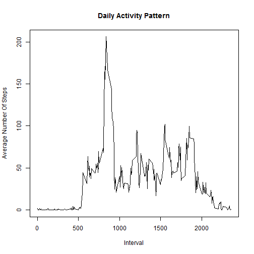
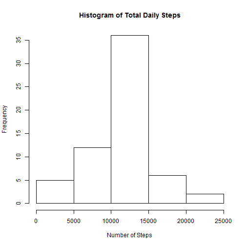
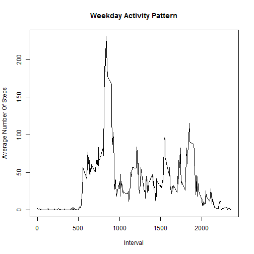
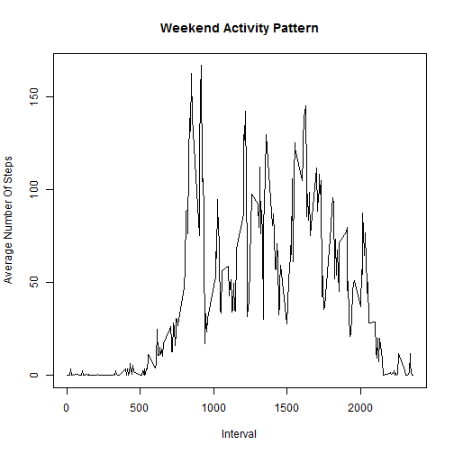

## Loading and preprocessing the data
The data is loaded from the csv file in character format. The individual fields are converted into appropriate data classes

```r
if(file.exists("activity.csv") != TRUE)
{
    unzip("activity.zip")
}

actData <- read.csv("activity.csv", colClasses="character")
actData$steps <- as.numeric(actData$steps)
actData$date <- as.Date(actData$date, "%Y-%m-%d")
actData$interval <- as.numeric(actData$interval)
intervalLevels <- as.numeric(levels(factor(actData$interval)))
```


## What is mean total number of steps taken per day?
The total steps taken per day is calculated and histogram of the same are plotted below

```r
naRmSum <- function(x) sum(x, na.rm = T)
stepSum <- tapply(actData$steps, factor(actData$date), naRmSum)
hist(stepSum, main = "Histogram of Total Daily Steps", xlab = 
         "Number of Steps", ylab = "Frequency")
```

 

```r
stepSumMean <- mean(stepSum, na.rm = T)
stepSumMedian <- median(stepSum, na.rm = T)
```
The mean and median values of the total number of steps per day are 9354.2295082 and 1.0395 &times; 10<sup>4</sup> respectively.


## What is the average daily activity pattern?
The averages of the number of steps is calculated per interval and a plot of the same is below

```r
naRmMean <- function(x) mean(x, na.rm = T)
intervalMean <- tapply(actData$steps, factor(actData$interval), naRmMean)
plot(intervalMean~levels(factor(actData$interval)), type="l", main = 
         "Daily Activity Pattern", xlab = "Interval", ylab = 
         "Average Number Of Steps")
```

 

```r
maxIntervalIndex <- which(intervalMean == max(intervalMean))
maxInterval <- intervalLevels[maxIntervalIndex]
```
The interval with the maximum number of steps on average is 835


## Imputing missing value
The number of missing values in the measurements is calculated. These values are then filled with the average value for that period.

```r
numMissingVal <- length(which(is.na(actData$steps)))
actDataNew <- actData
for(i in 1:length(actData$steps))
{
    if(is.na(actData$steps[i]))
    {
        intervalVal <- actData$interval[i] 
        actDataNew$steps[i] <- intervalMean[[which(intervalLevels == intervalVal)]]
    }
}
stepSumNew <- tapply(actDataNew$steps, factor(actDataNew$date), naRmSum)
hist(stepSumNew, main = "Histogram of Total Daily Steps", xlab = 
         "Number of Steps", ylab = "Frequency")
```

 

```r
stepSumMeanNew <- mean(stepSumNew, na.rm = T)
stepSumMedianNew <- median(stepSumNew, na.rm = T)
```
The new mean and median values of the total number of steps per day are 1.0766189 &times; 10<sup>4</sup> and 1.0766189 &times; 10<sup>4</sup> respectively.

## Are there differences in activity patterns between weekdays and weekends?
The activity patterns for weekends and weekdays are calculated and plotted below. It is observed that weekends have a higher activity as indicated by higher frequency of higher ranges of steps taken

```r
actDataNew$day <- weekdays(as.Date(actDataNew$date))
for(i in 1:length(actDataNew$date))
{
    if((actDataNew$day[i] == "Saturday") | (actDataNew$day[i] == "Sunday"))
    {
        actDataNew$wdWe[i] <- "Weekend"
    }
    else
    {
        actDataNew$wdWe[i] <- "Weekday"
    }
}
splitActData <- split(actDataNew, actDataNew$wdWe)

intervalMeanWd <- tapply(splitActData[[1]]$steps, 
                         factor(splitActData[[1]]$interval), naRmMean)
intervalMeanWe <- tapply(splitActData[[2]]$steps, 
                         factor(splitActData[[2]]$interval), naRmMean)

plot(intervalMeanWd~levels(factor(actDataNew$interval)), type= "l", main = 
         "Weekday Activity Pattern", xlab = "Interval", ylab = 
         "Average Number Of Steps")
```

 

```r
plot(intervalMeanWe~levels(factor(actDataNew$interval)), type = "l", main =
         "Weekend Activity Pattern", xlab = "Interval", ylab = 
         "Average Number Of Steps")
```

 
